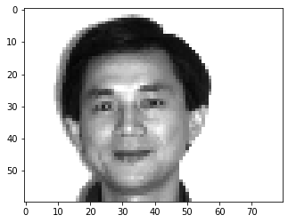
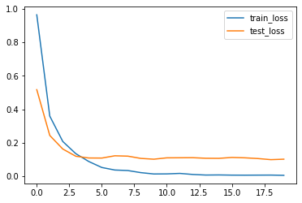
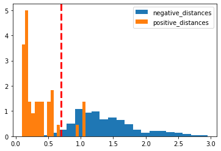

# Facial-Recognition

#### Approach   

 An implementation of Siamese Neural Networks for facial recognition

### Data

Using [yale face dataset](http://vision.ucsd.edu/content/yale-face-database)
_Collection of greyscale faces of differing light and facial expressions_

_example:_



### Siamese Network
 Contrastive loss implementation

%20-%20f(x_2)%7C%7C_2)

![L = yd^2 + (1 - y)\[max(m - d,0)\]^2](https://render.githubusercontent.com/render/math?math=L%20%3D%20yd%5E2%20%2B%20(1%20-%20y)%5Bmax(m%20-%20d%2C0)%5D%5E2)

```
def contrastive_loss(y, t):
    nonmatch = F.relu(1 - y) # max(margin - y, 0)
    return torch.mean(t * y**2 + (1 - t) * nonmatch**2)
```

### Findings

Training losses _(not very representative due to imbalanced classes)_



#### Evaluating the results

With an ad hoc threshold of 0.7.



**Sensitivity** _(true positive rate)_: 0.91

**Specificity** _(true negative rate)_: 0.96


